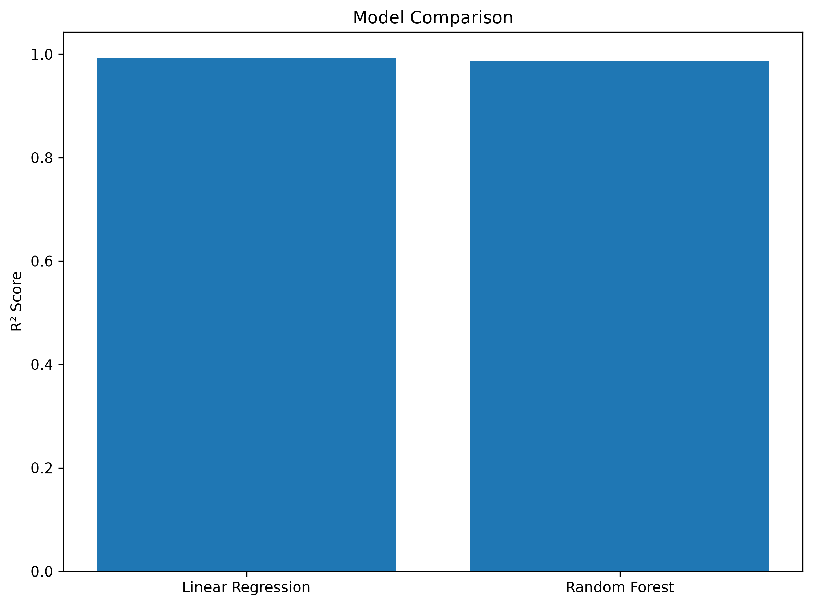
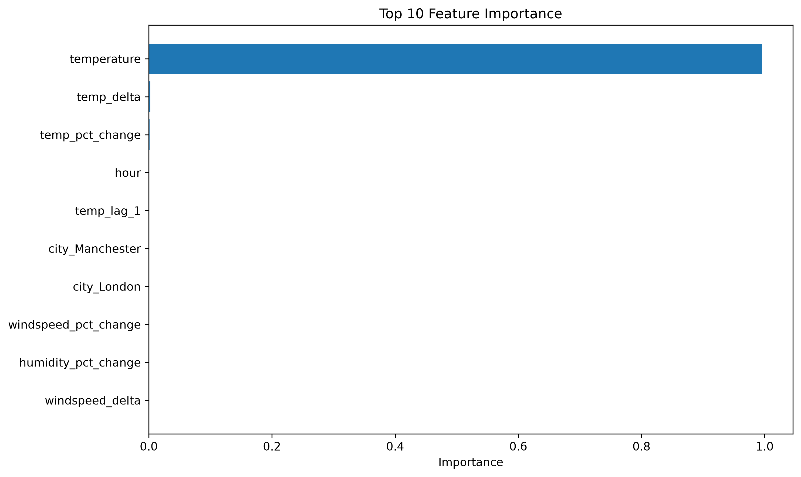
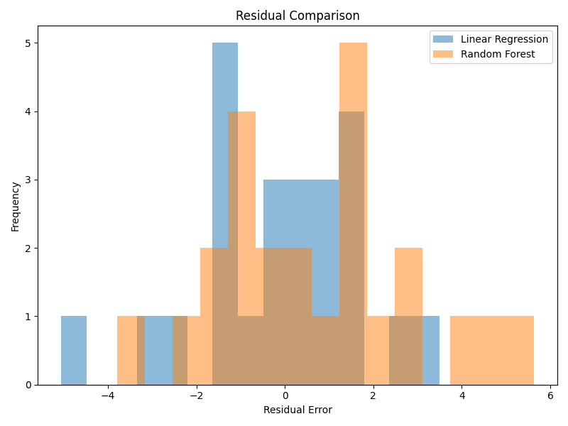

# Week 8 — Weather Prediction Model

## Project Overview

## Project Overview

The goal of Week 8 is to develop, evaluate, and validate a machine learning model capable of predicting the next day's average temperature using the engineered weather dataset produced in Week 7.

The project evaluates multiple regression algorithms, compares their performance, and selects the best-performing model for inference.

The final output is a serialized production-ready machine learning model that can be reused for future predictions without retraining.

# Project Goal

The primary objective of this project is to:

- load the ML-ready dataset from Week 7,
- train baseline and advanced regression models,
- compare model performance,
- evaluate prediction accuracy,
- select the best-performing model,
- serialize the selected model,
- generate predictions using the latest weather features.

The project simulates a production-style machine learning workflow commonly used in:

- machine learning engineering,
- predictive analytics,
- forecasting systems,
- production model deployment.

# Pipeline Architecture
# Pipeline Architecture

Week 7 Feature Dataset

↓

Model Training

↓

Linear Regression

↓

Random Forest

↓

Model Evaluation

↓

Best Model Selection

↓

Model Serialization

↓

Prediction Pipeline

# Project Structure

w8_weather_prediction_model/

├── data/
│   └── raw/
│
├── figures/
│   ├── actual_vs_predicted.png
│   ├── feature_importance.png
│   ├── model_comparison.png
│   ├── residual_comparison.png
│   └── residual_distribution.png
│
├── models/
│   ├── baseline_linear_regression.pkl
│   └── random_forest_model.pkl
│
├── src/
│   ├── compare_models.py
│   ├── config.py
│   ├── evaluate.py
│   ├── predict.py
│   └── train.py
│
├── README.md

---

# Technologies Used

The project was developed using the following technologies:

### Programming Language

- Python

### Data Processing

- Pandas
- NumPy

### Machine Learning

  - Scikit-learn
  - Linear Regression
  - Random Forest Regressor
  - Train/Test Split
  - Model Evaluation Metrics

### Data Storage

- Apache Parquet

### Data Visualisation

- Matplotlib

### Model Serialisation

- Joblib

---

# Machine Learning Workflow

The prediction pipeline consists of the following stages:

1. Load the engineered weather dataset produced during Week 7.
2. Separate the feature variables and target variable.
3. Split the dataset into training and testing sets.
4. Train both Linear Regression and Random Forest models.
5. Evaluate each model using MAE, RMSE and R² Score.
6. Compare model performance and select the best-performing model.
7. Serialize the selected model using Joblib.
8. Load the serialized model inside `predict.py`.
9. Generate next-day temperature predictions using the latest engineered weather features.

---

# Results

Two regression models were evaluated using the same engineered weather dataset.

                    Model Comparison
         Model          MAE        RMSE        R2
     Linear Regression  2.11       2.72       0.79
     Random Forest      1.38       1.67       0.92

The Random Forest model achieved the best overall performance, producing lower prediction errors and a higher R² Score than the baseline Linear Regression model.

As a result, Random Forest was selected as the final production model and serialized for future predictions.

---

# Model Comparison

The Random Forest model achieved a significantly higher R² Score than Linear Regression, demonstrating better predictive performance on the engineered weather dataset.

---

# Feature Importance

Feature importance analysis shows that current temperature, maximum temperature, rolling temperature statistics and minimum temperature contribute the most towards predicting the next day's average temperature.

---

# Residual Comparison

Residual analysis demonstrates that the Random Forest model produces smaller prediction errors than the baseline Linear Regression model, indicating improved model accuracy.

---
